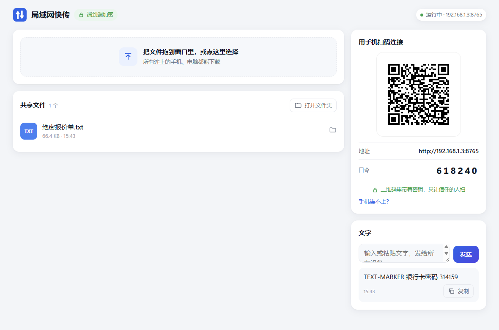
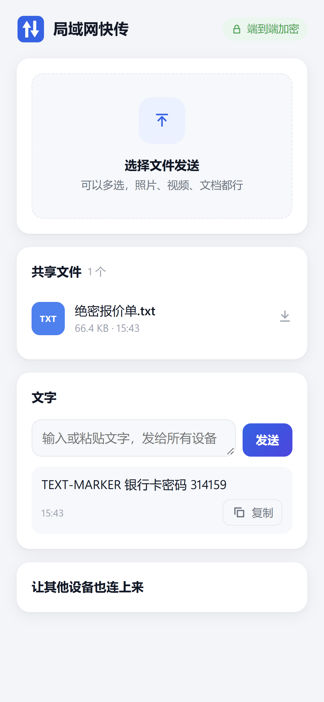

# 第 6 章　一次加密请求的完整旅程：浏览器 → WASM → Rust 服务端

## 这一步要解决什么

前面几章分别做好了加密核心、WASM 和服务端。这一章把它们连起来，做出真正给人用的页面。然后跟着**一条文字消息**，从手机走到电脑再走回来，看清每一层都做了什么。

| 电脑主界面（本机打开） | 手机（局域网 IP，口令登录后） |
|---|---|
|  |  |

## 全程示意

```
手机浏览器                                          电脑 LanShare.exe（Rust）
───────────                                         ─────────────────────────
① app.js：点“发送”
   client.rpc({op:"text_add", text})
② proto.js：JSON → UTF-8 字节
   ctr = ++this.ctr（本会话第几个请求）
③ 拷进 WASM 线性内存，调用 ls_seal
   └─ Rust：proto::seal(k_c2s, ctr, "lanshare/2 req /api/rpc", 明文)
      → 密文 + 16 字节认证标签
④ fetch POST /api/rpc                ── 网络上只有密文 ──►  ⑤ check_host：Host 是 IP / localhost？
   X-LS-Sid: 会话 id                                         security_headers：加 CSP 等
   X-LS-Ctr: 计数器                                       ⑥ channel::sealed
   Content-Type: application/octet-stream                    precheck（只看请求头，正文还没读）：
                                                             · Content-Type 必须是 octet-stream，长度不超限
                                                             · 查会话；计数器在窗口内且没用过？
                                                             拿名额（每 IP 8 个、全局 32 个），限时读正文
                                                             open_body：
                                                             · 锁外解密（aad 绑定路径）
                                                             · 再加锁：再查一次 + 登记计数器
                                                          ⑦ rpc::handle → texts.add(text)
                                                          ⑧ sealed_response：用 k_s2c、同一 ctr 加密
⑩ WASM ls_open 解密，校验认证标签    ◄── 网络上只有密文 ──
⑪ JSON → 界面（只用 textContent）
```

（这是第 9 章安全加固之后的流程。最初的版本里，第 ⑥ 步是先把整个正文读进内存、再查会话，审查发现这样会被人用大量连接撑爆内存。另外在第 ④ 步之前，连接本身还要先过“连接准入”：每个来源 IP 最多 16 个连接，请求头 10 秒内要收完。）

## 概念 1：密钥怎么到手机上，`#` 片段的妙用

二维码里的地址长这样：

```
http://192.168.1.222:8765/#diiD2RSS0AGhTcrBbp9SZ24xDiwmXjXqqMpSsBb4VZk
```

`#` 后面的部分叫**片段**（fragment）。按 HTTP 规范，浏览器**不会**把它放进请求里发出去，它只留在浏览器内部。所以密钥不经过 WiFi。（严格说，扫码 App 或浏览器的历史记录可能还记着这个网址，安全审查指出了这一点，见第 9 章。）

页面拿到之后立刻把它从地址栏里抹掉（`app.js`）：

```js
const key = keyFromFragment(location.hash);
if (key) history.replaceState(null, "", location.pathname); // 立刻把密钥从地址栏和历史记录里抹掉
```

**真实浏览器验证**：我在 Chrome 和服务端之间夹了一个录包代理（和第 5 章的抓包测试一样，只是这次是真浏览器），扫码进入、上传文件、发文字，一共录到 **637,444 字节**：

| 搜索内容 | 结果 |
|---|---|
| 二维码密钥（base64url / 原始字节 / hex 三种写法） | 找不到 |
| 口令、文件名、文件内容、文字 | 找不到 |
| 二维码图片的特征（`crispEdges`、`fill="#000"`） | 找不到 |
| 浏览器发出的第一行请求 | `GET / HTTP/1.1`（没有 `#密钥`） |

## 概念 2：为什么必须自己把加密代码带进浏览器

在手机视口下用局域网 IP 打开页面，在控制台检查一下：

```js
window.isSecureContext   // false
window.crypto.subtle      // undefined
```

`http://局域网IP` 不算“安全上下文”，浏览器的 WebCrypto API **根本不可用**。这就是第 1 章说的“Rust → WASM 的不可替代性”：加密代码必须由我们自己带进来，而且要能在 http 页面里运行（WASM 可以）。

## 概念 3：页面刷新怎么办，一个设计取舍

每个请求都有一个递增的计数器，服务端拒绝重复使用的计数器（防重放）。那页面刷新以后怎么办？

| 方案 | 问题 |
|---|---|
| 把会话和计数器存进 `localStorage` | 两个标签页同时用同一个会话，计数器会冲突；刷新时机不巧也会撞号 |
| **只存二维码密钥 K，每次打开页面都用新的会话 id 重新握手**（采用） | 每个标签页、每次刷新都是独立会话，计数器都从 1 开始，互不干扰 |

用口令登录的设备本来不知道 K。配对成功后，服务端会通过**加密信道**把 K 发给它（反正它本来也能看到二维码），所以下次打开也不用再输口令。

服务重启后会生成新的 K 和新的 server_id。旧页面下一次轮询拿到 401，会先尝试用存下的 K 重连。重连失败，就回到口令页，并提示“电脑上的程序重启过，请重新扫码或输入口令”。这个流程在浏览器里实测过。

## 概念 4：CSP，把“不执行别人的代码”写进响应头

服务端给每个页面响应都加上这个头：

```
Content-Security-Policy: default-src 'none'; script-src 'self' 'wasm-unsafe-eval'; style-src 'self';
                         img-src 'self' blob:; connect-src 'self'; ...
```

意思是：只允许本站的脚本和样式；允许编译 WASM；图片只能来自本站或 `blob:`；请求只能发回本站。**内联 `<script>`、内联 `style=""` 属性、`onclick=""` 一律禁止。**

所以 v2 的页面拆成了 `index.html` + `style.css` + `app.js` + `proto.js` 四个文件，并且有一项静态测试（`web-tests/page.test.mjs`）守住这条规则。二维码是 SVG 文本，没有用 `innerHTML` 塞进页面，而是：

```js
qrUrl = URL.createObjectURL(new Blob([info.qr_svg], { type: "image/svg+xml" }));
$("qr").src = qrUrl;   // 当作图片加载：SVG 里就算有脚本也不会执行
```

## 测试：三层互相印证

| 测试 | 证明什么 |
|---|---|
| `web-tests/crypto.test.mjs`（8 项） | 浏览器端 WASM 的结果和 OpenSSL 逐字节一致 |
| `web-tests/interop.test.mjs`（8 项） | **JS/WASM 客户端 ↔ 真实 LanShare.exe** 能扫码配对、口令配对（两端 SPAKE2 互通）、上传 3 MiB 后下载回来 sha256 一致、记住密钥免输入 |
| `web-tests/page.test.mjs`（5 项） | 没有内联脚本/样式/事件，不引用外部资源，不用任何 HTML 注入点 |
| 浏览器实测 | 扫码进入、口令错误提示、正确口令登录、手机下载、刷新重连、服务重启后回到口令页 |

## 真实踩坑

1. **Node 的 `spawn` 不接受 URL 对象。** 测试里用 `new URL(...)` 拼了 exe 路径，直接传给 `spawn` 报 `ERR_INVALID_ARG_TYPE`，要先用 `fileURLToPath` 转成字符串。
2. **`node --test web-tests/` 不会扫描目录**，它会把目录当成一个模块去执行。要写成 `node --test "web-tests/*.test.mjs"`。
3. **测试找到了 `<svg`**：真实浏览器抓包里搜到了 `<svg`。我没有直接当成误报放过，而是逐个定位，发现全是页面公开的图标；再确认真实二维码 SVG 的特征（`crispEdges`）在抓包里找不到。**测试报警时，要先查清楚，再下结论。**

## 动手试试

```bash
cargo build -p lanshare
node --test "web-tests/*.test.mjs"        # 21 项
target/debug/LanShare.exe --no-tray --port 8765   # 然后手机扫码打开
```

用手机浏览器打开后，在电脑浏览器里访问 `http://手机能访问的地址/`，F12 → 网络面板，看看 `/api/rpc` 请求体是不是一堆看不懂的字节。

## 和 Python 对照：v1 的口令是怎么泄露的

这一章的设计，正好修掉了 v1 最大的安全问题。看 v1 扫码进入时的代码（`legacy-python/lanshare/server.py`）：

```python
def _index(self, query):
    pin = parse_qs(query).get("k")        # 口令在 ?k=123456 里 —— 查询参数，会被发到网络上
    if pin:
        result, token = self.state.auth.try_login(self.client_address[0], pin[0])
        if result == OK:
            self.send_response(303)
            self.send_header("Location", "/")
            self._send_cookie(token)      # Cookie 也是明文
```

| | v1（Python） | v2（Rust + WASM） |
|---|---|---|
| 扫码地址 | `http://ip:8000/?k=123456`，口令在请求里 | `http://ip:8000/#密钥`，密钥不出浏览器 |
| 登录凭证 | Cookie，明文传输，抓到就能冒用 | 会话密钥只在两端各自算出来，从不传输 |
| 手动输口令 | 口令明文发给服务端 | SPAKE2，抓包拿不到任何可以离线破解的信息 |
| 文件、文字 | 明文 | ChaCha20-Poly1305 加密 |
| 页面防注入 | 不用 `innerHTML`（靠自觉 + 测试） | 同上，再加 CSP 响应头从浏览器层面兜底 |

同样是“局域网传文件”，v1 用 Python 很快就写出来了，能用；v2 想让它“在不可信的 WiFi 上也安全”，就得在浏览器里做加密。浏览器里的 Python 太重（Pyodide 约 10 MB），这正是用 Rust 编译成 WASM（95.7 KB）的原因。

## 小测验

**1. 为什么把密钥放在 `#` 后面，而不是 `?key=` 里？**

<details><summary>答案</summary>

`?key=` 属于查询参数，会出现在 HTTP 请求行里发到网络上，抓包能直接看到。`#` 后面的片段按规范只留在浏览器里，不会发出去。
</details>

**2. 手机通过 `http://192.168.x.x` 打开页面时，为什么不能直接用浏览器的 `crypto.subtle`？**

<details><summary>答案</summary>

WebCrypto 只在“安全上下文”（HTTPS 或 localhost）里可用。局域网 IP 的 http 页面不是安全上下文，`crypto.subtle` 是 `undefined`。所以只能自己带加密代码，这里用的是 Rust 编译出来的 WASM。
</details>

**3. 为什么页面只存二维码密钥，不存会话和计数器？**

<details><summary>答案</summary>

计数器必须全局唯一，服务端会拒绝重复的计数器。存会话的话，多个标签页、刷新时机都可能导致计数器冲突。只存 K、每次打开都用新的会话 id 重新握手，每个页面都是独立会话，从根本上避免了冲突。
</details>

**4. CSP 里的 `'wasm-unsafe-eval'` 是干什么的？去掉它会怎样？**

<details><summary>答案</summary>

允许页面编译、实例化 WebAssembly。去掉后 `WebAssembly.instantiate` 会被 CSP 拦截，加密模块加载失败，页面显示“加载加密模块失败”。它只放开 WASM 编译，不放开 JS 的 `eval`。
</details>

**5. 二维码 SVG 为什么用 `Blob` + `` 显示，而不是插进页面？**

<details><summary>答案</summary>

插进页面需要 `innerHTML` 之类的 HTML 注入点，项目里禁止使用。另外，作为 `` 加载的 SVG 里即使有脚本也不会执行。再加上 CSP 的 `img-src blob:`，只放行这一种用法。
</details>

**6. 真实浏览器抓包时搜到了 `<svg`，你会怎么判断是不是泄露？**

<details><summary>答案</summary>

不要直接下结论。先定位每一处出现的位置和上下文（这次全是 `index.html` 里公开的图标），再用**只属于秘密的特征**去搜（二维码 SVG 的 `crispEdges` / `fill="#000"`），并且先确认真实的秘密里确实含有这些特征，这样“搜不到”才有意义。
</details>
