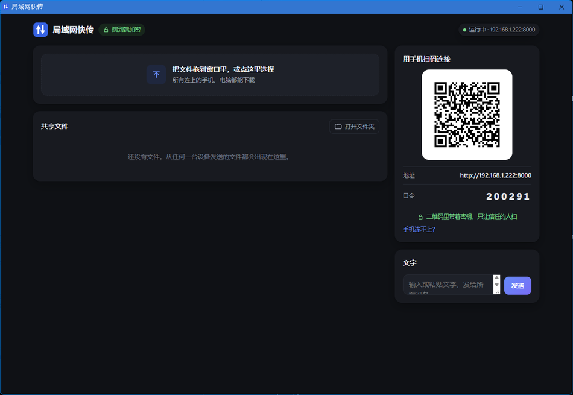
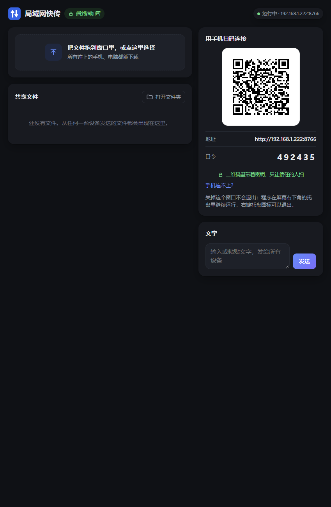

# 第 7 章　Windows 桌面外壳：调系统 API、`cfg` 条件编译、消息循环、`Drop`

## 这一步要解决什么

服务端和网页都能用了，但它还只是“命令行里跑起来的一个服务”。要变成用户双击就能用的软件，还差这些：

1. **双击不弹黑色命令行窗口**，但从终端运行时 `--help` 还要能看到输出；
2. **只开一个**：已经在运行时再双击，打开已有的那个，不要再起一个；
3. **托盘图标**：关掉窗口后程序继续在后台跑，右键能退出；
4. **主界面**：用 Edge 的“应用窗口”打开，没有地址栏，像一个独立程序；
5. **端口不被劫持**：别的程序占了 `127.0.0.1:8000` 时，我们不能和它“共用”这个端口；
6. **关机不拦着**：Windows 关机时问“可以关吗”，程序要回答“可以”。

这些全都是和 **Windows 操作系统**打交道，Rust 里要通过 `unsafe` 调用 Windows API。



*双击 exe 后自动打开的应用窗口：没有地址栏，左上角“端到端加密”，右边是给手机扫的二维码。*

## 程序启动的全流程

```
main()
 ├─ AttachConsole：从终端启动就接上终端，双击启动就什么都不做
 ├─ 解析命令行参数（第 4 章的 cli.rs）
 ├─ 单实例：CreateMutexW("Local\LanShare-v2")
 │    └─ 已经有人拿着 → 读实例记录（端口 + 密钥）→ 打开它的主界面 → 退出
 ├─ 绑定端口：SO_EXCLUSIVEADDRUSE，被占用就往后试 10 个
 ├─ 手动建 tokio 运行时，把服务丢到后台线程
 ├─ 打开 Edge 应用窗口：http://127.0.0.1:端口/#密钥
 └─ 主线程进入 Win32 消息循环（托盘图标就靠它活着）
       用户点“退出” → 消息循环结束 → 通知服务优雅关闭 → 删实例记录 → 退出
```

## 概念 1：`cfg`，编译期的 `if`

`main.rs` 第一行：

```rust
#![cfg_attr(windows, windows_subsystem = "windows")]
```

- `#![...]`（带感叹号）是作用于**整个 crate** 的属性；
- `cfg_attr(条件, 属性)`：条件成立时才加上这个属性；
- `windows_subsystem = "windows"`：告诉链接器这是“窗口程序”，Windows 启动它时不分配黑色控制台。

项目里还有很多 `#[cfg(windows)]` / `#[cfg(not(windows))]`：

```rust
#[cfg(windows)]
pub fn shell_open(target: &str) { /* 调 ShellExecuteW */ }

#[cfg(not(windows))]
pub fn shell_open(target: &str) { /* 调 xdg-open */ }
```

**`cfg` 是在编译时做选择**：在 Windows 上编译，第二个函数根本不会被编进程序：编译器只要求它语法正确，名字解析、类型检查统统跳过。这和 Python 的 `if os.name == "nt":` 不一样，后者两段代码都在，运行时才判断走哪段。

## 概念 2：调 Windows API，`unsafe` 和 UTF-16

Windows 的 API 是 C 写的。`windows-sys` 这个 crate 把它们声明成了 Rust 函数，但全部标为 `unsafe`：编译器没法检查你传的指针是否有效。

我第一次照着 Python `ctypes` 的习惯直接传字符串（真实的编译报错）：

```rust
MessageBoxW(std::ptr::null_mut(), "你好", "标题", MB_OK);
```

```
error[E0308]: arguments to this function are incorrect
note: expected `*const u16`, found `&str`
    = note: expected raw pointer `*const u16`
                 found reference `&'static str`
```

Windows 的 `W` 系列函数要的是**以 0 结尾的 UTF-16 字符串的指针**。Rust 的 `&str` 是 UTF-8，而且不以 0 结尾。要手动转换：

```rust
fn wide(s: &str) -> Vec<u16> {
    s.encode_utf16().chain(std::iter::once(0)).collect()
}
```

类型对了以后，第二个真实报错：

```
error[E0133]: call to unsafe function `MessageBoxW` is unsafe and requires unsafe block
```

最终的样子（`desktop/shell.rs`）：

```rust
let (text, title) = (wide(message), wide("局域网快传"));
// SAFETY: 两个字符串都以 0 结尾、调用期间有效；父窗口为空表示没有所属窗口。
unsafe { MessageBoxW(std::ptr::null_mut(), text.as_ptr(), title.as_ptr(), MB_ICONERROR) };
```

注意 `text` 和 `title` 是先存进变量再取指针的。如果写成 `let p = wide(message).as_ptr();`，那个 `Vec` 是临时值，这条 `let` 语句一结束就被释放，`p` 就成了悬空指针。新版编译器（本项目用的是 1.96）对这种最常见的写法会给出警告，真实输出：

```
warning: this creates a dangling pointer because temporary `Vec<u16>` is dropped at end of statement
 --> src\main.rs:9:24
  |
9 |     let p = wide("你好").as_ptr();
  |             ------------ ^^^^^^ pointer created here
  |             |
  |             this `Vec<u16>` is dropped at end of statement
  |
  = help: bind the `Vec<u16>` to a variable such that it outlives the pointer returned by `as_ptr`
  = note: `#[warn(dangling_pointers_from_temporaries)]` on by default
```

但它只是**警告**，程序照样编译通过；写法稍微绕一点，警告就不一定能发现了。裸指针指向的东西还在不在，总体上不归编译器管（见小测验第 3 题）。`// SAFETY:` 注释是 Rust 社区的惯例：每个 `unsafe` 块都写清楚“为什么这里是安全的”，审查代码时逐条核对。

## 概念 3：`Drop`，以及 `let _` 和 `let _x` 的区别

单实例靠 Windows 的**命名互斥量**：同一个名字只有一个进程能拿到，进程退出（哪怕是崩溃）时系统自动释放。

```rust
pub struct InstanceLock { handle: HANDLE }

impl Drop for InstanceLock {
    fn drop(&mut self) {
        // SAFETY: handle 来自 CreateMutexW，只在这里关闭一次。
        unsafe { CloseHandle(self.handle) };
    }
}
```

`Drop` 就是“离开作用域时自动执行的清理代码”。`main` 里这样持有它：

```rust
let _lock = if args.single_instance { ... InstanceLock::acquire(MUTEX_NAME) ... };
```

**这里有个 Rust 新手几乎必踩的坑**：`let _lock = ...` 和 `let _ = ...` 看起来差不多，行为完全不同。下面是一个真实运行的小程序：

```rust
struct Lock(&'static str);
impl Drop for Lock {
    fn drop(&mut self) { println!("释放 {}", self.0); }
}

fn main() {
    let _ = Lock("A");     // 下划线本身：值立刻被丢弃
    let _b = Lock("B");    // 以下划线开头的名字：活到作用域结束
    println!("main 里的工作做完了");
}
```

真实输出：

```
释放 A
main 里的工作做完了
释放 B
```

- `let _ = 值`：`_` 不是变量名，而是“我不要这个值”，值**当场**被丢弃；
- `let _b = 值`：`_b` 是一个普通变量，下划线开头只是告诉编译器“我知道没用到它，别警告”，它活到 `}`。

如果单实例写成 `let _ = InstanceLock::acquire(...)`，互斥量拿到就立刻释放，单实例就形同虚设，而且**编译器不会报错**。托盘也一样：`let _tray = TrayIconBuilder::new()...build()?;` 要是写成 `let _ =`，托盘图标刚创建就消失。

## 概念 4：消息循环，以及为什么不用 `#[tokio::main]`

Windows 的窗口（托盘图标背后也有一个隐藏窗口）靠**消息循环**活着：系统把“鼠标点了图标”“要关机了”这些事件放进队列，程序在循环里一条条取出来处理。

```rust
// SAFETY: 标准的 Win32 消息循环；msg 是本地变量，GetMessageW 返回 0 表示收到 WM_QUIT。
unsafe {
    let mut msg: MSG = std::mem::zeroed();
    while GetMessageW(&mut msg, std::ptr::null_mut(), 0, 0) > 0 {
        TranslateMessage(&msg);
        DispatchMessageW(&msg);
    }
}
```

这个循环必须跑在**创建托盘图标的那个线程**上。我们让主线程来跑托盘（tray-icon 在 macOS 上要求主线程，在 Windows 上只要求“创建图标的线程”，这里统一用主线程，是我们的选择）。tokio 最常见的写法是在 `main` 上标 `#[tokio::main]`，让主线程去驱动异步运行时，和“主线程跑托盘”冲突。所以这里手动建运行时，把服务交给 tokio 的工作线程：

```rust
let runtime = tokio::runtime::Builder::new_multi_thread().enable_all().build()?;
let (stop_tx, stop_rx) = tokio::sync::oneshot::channel::<()>();
let server_task = runtime.spawn(server::serve_with_shutdown(listener, state.clone(), async {
    let _ = stop_rx.await;       // 等“停止”信号
}));

let tray = run_tray(&state);     // 主线程阻塞在消息循环里，直到用户点“退出”
let _ = stop_tx.send(());        // 通知服务：不再接新连接，处理完手上的请求就停
```

- `runtime.spawn(...)`：服务跑在 tokio 的工作线程上，不占主线程；
- `oneshot::channel`：一次性的“信号通道”，一端发、一端等，用来跨线程说一句“该停了”。

**关机的那个坑（v1 踩过）**：Windows 关机前会给每个窗口发 `WM_QUERYENDSESSION`，问“可以结束吗”，返回 0 就是“不行”。v1 用的 Python 托盘库 pystray 对它不认识的消息一律返回 0，等于每次关机都被它拦一下。v2 用的 tray-icon 把不认识的消息交给系统默认处理（`DefWindowProcW`），默认就是同意。光看源码不算数，我用 PowerShell 找到托盘的隐藏窗口，真的发了一条这个消息：

```
WM_QUERYENDSESSION -> delivered=True answer=1 (1 = agrees to shut down)
```

## 概念 5：回调，`Arc<dyn Fn() + Send + Sync>`

托盘菜单被点击时要调用我们的代码（打开主界面、打开文件夹）。托盘模块不应该知道“主界面网址”这些细节，所以由 `main` 把**要做的事**作为参数传进去：

```rust
pub type Action = Arc<dyn Fn() + Send + Sync>;

pub fn run(tooltip: &str, on_open: Action, on_folder: Action) -> Result<(), String>
```

逐个拆开：

| 写法 | 意思 |
|---|---|
| `Fn()` | 可以反复调用、无参数无返回值的“函数一类的东西” |
| `dyn Fn()` | 具体是哪个闭包不重要，只要能这么调用就行（trait 对象） |
| `+ Send + Sync` | 可以交给别的线程、也可以被多个线程同时引用 |
| `Arc<...>` | 引用计数指针：同一个回调可以被多处持有（菜单、左键单击都要用“打开”） |

`main` 里构造它：

```rust
let url = state.local_entry_url();
Arc::new(move || shell::open_app_window(&url))
```

`move` 把 `url` 移进闭包，闭包自己拥有这份字符串，不依赖 `main` 里的变量还活着。

## 概念 6：端口独占，用变异测试证明测试有用

第 4 章的服务端用 `tokio::net::TcpListener::bind` 就够了，但 Windows 有个默认行为：`0.0.0.0:8000` 可以和别的程序的 `127.0.0.1:8000` **同时存在**，而发往 `127.0.0.1:8000` 的请求会进别人的程序。本机的应用窗口用的正是 `127.0.0.1`。

`net.rs` 用 `socket2` 先建 socket，绑定前设置 `SO_EXCLUSIVEADDRUSE`，再交给 tokio：

```rust
let socket = Socket::new(Domain::IPV4, Type::STREAM, Some(Protocol::TCP))?;
exclusive(&socket)?;                          // Windows 上 setsockopt(SO_EXCLUSIVEADDRUSE)
socket.bind(&SocketAddr::from((ip, port)).into())?;
socket.listen(1024)?;
socket.set_nonblocking(true)?;                // 交给 tokio 之前必须是非阻塞的
```

测试 `port_taken_on_a_specific_address_is_skipped` 先用普通方式占住 `127.0.0.1:P`，再要求我们绑 `0.0.0.0:P` 时必须换端口。**测试写了，怎么知道它真的能抓住问题？** 把 `exclusive(&socket)?;` 这一行注释掉再跑（变异测试）：

```
test net::tests::port_taken_on_a_specific_address_is_skipped ... FAILED
```

去掉防护，测试就失败；恢复后又通过。这才说明这个测试守住了这条防线。

## 真实踩坑

1. **重定向输出时会弹窗卡住。** 最初用“`AttachConsole` 成功没有”判断有没有控制台，没有就用弹窗报错。可是自动化测试用管道读输出时，`AttachConsole` 可能失败，`--help` 就会弹出一个对话框，测试一直卡着等人点“确定”。改成判断“标准输出句柄能不能用”：接上了终端或者输出被重定向，都算能用。
2. **残留的状态文件。** 程序崩溃或电脑直接断电时，实例记录（端口 + 密钥）不会被删。下次双击两下，第二个进程可能读到**上一次**的旧端口。修法：拿到互斥量后第一件事就删掉旧记录。巧的是，我写的测试脚本也犯了同一个错：它读到了上一轮留下的 `info.json`，去连一个早就关掉的端口（`ECONNREFUSED 127.0.0.1:51319`）。**“读状态文件”时一定要想：这个文件是不是这一次写的？**
3. **日志时间看不懂。** 一开始写的是 Unix 秒数 `[1790930921]`，改成调用 `GetLocalTime` 输出 `[2026-10-02 17:49:58]`。
4. **测试环境本身也会骗人。** 为了验证“`--no-tray` 能用 Ctrl+C 退出”，我写了个脚本：新开一个控制台，在里面启动 LanShare，再发一个 Ctrl+C。结果它不退出。排查了一圈发现：从 Git Bash 启动的程序，“忽略 Ctrl+C”这个状态是**继承**来的，测试脚本和它启动的 LanShare 都带着这个状态。先用 `SetConsoleCtrlHandler(NULL, FALSE)` 恢复正常再启动，LanShare 立刻退出，退出码 0。程序没错，是测试的环境和用户的环境不一样。
5. **v1 有启动气泡，v2 的托盘库没有。** v1 启动时会弹个气泡说“关掉窗口后它会继续在托盘里运行”。tray-icon 不支持气泡，于是把这句话写在本机界面上（只有电脑上的窗口显示，手机上不显示）：



## 怎么验证的（不只是单元测试）

| 验证 | 方法 | 结果 |
|---|---|---|
| 二次启动交给已有实例 | PowerShell 启动 A，再启动 B | B 退出码 0，日志“已经在运行，打开已有实例的主界面” |
| 同意关机 | 找到托盘隐藏窗口，发 `WM_QUERYENDSESSION` | 返回 1 |
| 退出干净 | 给主线程发 `WM_QUIT`（等同于点“退出”） | 退出码 0，实例记录已删，端口已释放 |
| 应用窗口自动配对 | 正常双击启动，截图 | 窗口打开即进入主界面（上面的截图） |
| 资源管理器定位 | 文件名 `报价, 终版.txt`，放在“共享 文件夹”里 | 资源管理器打开并选中了这个文件 |
| `--no-tray` 能 Ctrl+C 退出 | 新控制台里启动，发 `CTRL_C_EVENT` | 退出码 0，日志“已退出” |

## 动手试试

```bash
cargo build -p lanshare
./target/debug/LanShare.exe --help           # 终端里能看到帮助
./target/debug/LanShare.exe --no-tray --port 8765 --dir ./tmp-share   # 前台运行，Ctrl+C 退出
```

在 cmd / PowerShell 里运行时，提示符会**立刻**回来，程序的输出会接着打印在后面。这是 `windows_subsystem = "windows"` 的代价：对系统来说它是窗口程序，终端不会等它结束。双击不弹黑窗口和终端里体验完整，二者不可兼得，这里选了前者。

在资源管理器里双击 `target\debug\LanShare.exe`：没有黑窗口，直接弹出应用窗口，托盘里出现图标。再双击一次：不会起第二个，而是又打开一个主界面窗口。

## 和 Python 对照

| 要做的事 | Python v1 | Rust v2 |
|---|---|---|
| 不弹控制台 | PyInstaller `--windowed`（或者用 `pythonw.exe` 运行） | `#![windows_subsystem = "windows"]` |
| 区分平台 | `if os.name == "nt":`，运行时判断 | `#[cfg(windows)]`，编译时选择 |
| 弹窗 | `ctypes.windll.user32.MessageBoxW(None, message, TITLE, 0x10)` | `unsafe { MessageBoxW(null, text.as_ptr(), title.as_ptr(), MB_ICONERROR) }` |
| 字符串传给 Windows | ctypes 自动把 `str` 转成 UTF-16 | 手动 `encode_utf16().chain(once(0))` |
| 托盘 | `pystray.Icon(...).run()`（主线程） | `tray-icon` + 手写消息循环（主线程） |
| 服务端 | `threading.Thread` 里跑 `serve_forever()` | `runtime.spawn(...)` 交给 tokio |
| 单实例 | `instance.json` + 连过去探测活没活着（等 1 秒超时） | 命名互斥量（系统管理，进程一死自动释放） |
| 清理资源 | `try/finally`、`with`、`__del__`（时机不保证） | `Drop`（离开作用域**必定**执行） |
| 关机 | pystray 默认拒绝，要手动往 `_message_handlers` 里塞处理函数 | tray-icon 默认同意，实测确认 |

**ctypes 和 Rust 调 Windows API，本质是同一件事**，区别在于“谁替你检查”：

```python
# v1 desktop.py：ctypes 帮你把 str 转成 UTF-16，传错类型要到运行时才知道
ctypes.windll.user32.MessageBoxW(None, message, TITLE, 0x10)
```

```rust
// v2 shell.rs：类型不对编译不过，但转换得自己写，unsafe 也得自己写
unsafe { MessageBoxW(std::ptr::null_mut(), text.as_ptr(), title.as_ptr(), MB_ICONERROR) };
```

**v1 关机问题的修法**，看看 Python 里的“猴子补丁”：

```python
# v1 desktop.py：往 pystray 的私有字典里塞处理函数
handlers = getattr(icon, "_message_handlers", None)
if not isinstance(handlers, dict):
    return
handlers[WM_QUERYENDSESSION] = lambda wparam, lparam: 1
```

Python 能随意改别人对象的内部（以下划线开头的“私有”成员也能改），所以能这样打补丁，但库一升级就可能失效。Rust 的结构体私有字段从外部**根本访问不到**。好在 v2 用的库默认行为就是对的，用不着打补丁。

**`__del__` vs `Drop`：** Python 的 `__del__` 什么时候执行由垃圾回收决定，不保证及时，所以 Python 里管理锁、文件这类资源要用 `with`。Rust 的 `Drop` 在离开作用域时**一定**执行，时机确定，所以 Rust 不需要 `with` 语法，任何变量都自带“`with` 效果”。

## 小测验

**1. 下面两行代码有什么区别？哪一行会让单实例失效？**
```rust
let _ = InstanceLock::acquire("Local\\LanShare-v2");
let _lock = InstanceLock::acquire("Local\\LanShare-v2");
```

<details><summary>答案</summary>

`let _ =` 让值立刻被丢弃，`Drop` 当场执行，互斥量拿到就释放，**单实例失效**；编译器不会报错。`let _lock =` 是一个普通变量，活到所在作用域结束，互斥量一直被持有。
</details>

**2. `#[cfg(windows)]` 和 Python 的 `if os.name == "nt":` 有什么本质区别？**

<details><summary>答案</summary>

`cfg` 在**编译时**生效：条件不成立的代码不会被编译进程序（连类型检查都不做）。Python 的 `if` 在**运行时**判断，两个分支的代码都在程序里。
</details>

**3. 这段代码有什么隐患？**
```rust
unsafe { MessageBoxW(std::ptr::null_mut(), wide(msg).as_ptr(), title.as_ptr(), MB_OK) };
```

<details><summary>答案</summary>

`wide(msg)` 返回的 `Vec<u16>` 是临时值。按 Rust 的规则，这个临时值会活到这条语句结束，所以**这一行恰好不出错**。但只要把 `.as_ptr()` 的结果存进变量、下一行再用，指针就悬空了。对这种最常见的写法，编译器会给出 `dangling_pointers_from_temporaries` 警告，但只是警告，照样编译通过；裸指针的有效性总体上不归编译器管，这正是它要求写 `unsafe` 的原因。稳妥的写法是先 `let text = wide(msg);`，再用 `text.as_ptr()`。
</details>

**4. 为什么这一章不用 `#[tokio::main]`？**

<details><summary>答案</summary>

托盘图标的 Win32 消息循环必须跑在创建它的线程（主线程）上，而 `#[tokio::main]` 会让主线程去驱动异步运行时。于是手动建运行时，用 `runtime.spawn` 把服务放到工作线程上，主线程留给消息循环。
</details>

**5. 托盘回调的类型为什么要带 `Send + Sync`？Python 里为什么不用操心这个？**

<details><summary>答案</summary>

回调会被托盘库保存起来，在别的地方、甚至别的线程上调用。`Send + Sync` 是向编译器保证：这个闭包跨线程传递、被多个线程共享都是安全的。Python 有 GIL，同一时刻只有一个线程在执行 Python 代码，而且语言本身不检查这类事情，所以不用声明；代价是出了竞态问题只能靠自己发现。
</details>

**6. 程序崩溃后留下了 `instance.json`。下次启动时可能出什么问题？v2 怎么防的？**

<details><summary>答案</summary>

后启动的实例可能读到旧记录，去打开一个已经不存在的端口。v2 的做法：拿到互斥量的实例**第一件事就删掉旧记录**，等服务启动后再写入新的。只有拿不到互斥量的“后来者”才去读记录，读到的一定是当前持有者写的（或者等它写好）。
</details>
